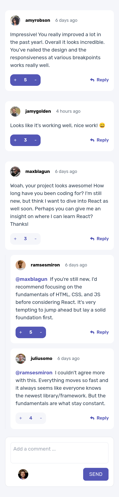

# Interactive full stack posts website

## Technologies used

- Next.js 14
- Tailwind
- React Hook Form
- Prisma
- tRPC
- zod
- Vercel (deployment and database)

## The user is able to

- View the optimal layout for the app depending on their device's screen size
- Create, Read, Update, and Delete comments and replies
- Upvote or downvote posts only once
- Dynamically track the time since the comment or reply was posted.

### Expected behaviour

- First-level comments are ordered by their score, whereas nested replies are ordered by time added.
- Replying to a comment adds the new reply to the bottom of the nested replies within that comment.
- A confirmation modal pops up before a comment or reply is deleted.
- You can only edit or delete your own comments and replies

### Screenshot mobile

### Screenshot desktop

